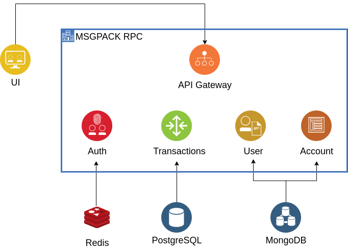

# UCU-bank

## Table of contents
- [Introduction](#introduction)
- [Features](#features)
- [Project structure](#project-structure)
- [Tools and frameworks](#tools-and-frameworks)
- [Setup](#setup)
- [Usage](#usage)
- [Contributors](#contributors)

## Introduction
UCU Bank - simple implementation of the online banking system.

This project is a semester project for three courses: Software architecture (SWA), Information security (IS) and Modern C++, so it has to fit the following "general" requirements:
- Flexible and reliable microservice architecture 
- Secure architecture with modern security features
- Fast, modern & flexible code that uses most modern features of c++

### Implementation requirements
- Simple web interface, where user can sign up/login1 using his passport data
- Users can create many cards
- Users can make money transactions to other users
- Users can make a deposit or take credit with a fixed percentage
- There should be privileged accounts of bank workers, where they see all accounts, amount of money on cards, personal information of users
- All transaction data and data about the amount of money should be duplicated on many databases and secured properly
- It should be guaranteed that in case of any software or hardware error, the system remains consistent and correct (i.e., there should not be a situation when an error happened while processing transaction, money on sending account are withdrawn, and they didn't appear on the other account, or vice versa)

## Features
### Security features
|status  | feature |
|:------:| :---------------- |
| TODO   | Salted password hashing (BCrypt Password Encoder) |
| TODO   | 2 - factor authentication with password + email |
| TODO   | Use SSL  |
| TODO   | Request identification (authenticate each request and authenticate the request even after post-login1. This will prevent any session hijack) |
| TODO   | Role-Based access control for admin/regular | 
| TODO   | The alert mechanism ensures that the customer remains informed of all the critical events that can have a financial impact |
| TODO   | Captcha |


## Project structure


## Tools and frameworks

Base language - python 3.8. For front-end - ReactJS 17.0.2

### Base frameworks:

#### Backend:
- NoSQL Database - MongoDB
    - Is Document-Oriented, which makes it easy to use - just like ordinary dictionary
    - Supports distributed systems
    - Has good documentation and convenient python binding
- Relational DataBase - PostgreSQL
  - Good documentation
  - Open source
- Drogon
  - Is highly asynchronous
  - Supports REST API
- Reddis
  - Simple and highly effective distrubuted map
- AWS SES
  - Used for double verification
- Kafka
    - Fast
    - Makes it really easy to create distributed system and maintain dataflow
    - Many examples of real usage
    - Easily can become a message broker between microservices
- rpclib + msgpack
  - used for communication between services
  - Simple and effective
  - Can be async
- Safety:
    - bcrypt library - for password hashing
    - pyotp - 2 - factor authentication

#### Frontend:
- MaterialUI
	- Has many built-in UI elements that speeds up developing
	- Quite well-looking
- react-google-recaptcha
	- Simple way to use captcha


## Setup
0. Install dependencies.
    - Archlinux:
    ```bash
    sudo pacman -S postgresql mysql hiredis util-linux-libs openssl zlib
	```


## Usage

[//]: # (> Devs Only :&#41;)
[//]: # (- To configure project and install dependencies)
[//]: # (	```bash[//]: # &#40;1. Install other dependencies &#40;submodules&#41;: &#41;)
[//]: # (```bash)
[//]: # (./configure.sh)
[//]: # (```)
[//]: # ()
[//]: # (	python3 setup.py)

[//]: # (	```)
- To build project 
	```bash
	python3 build.py <build-preset> [--clean|-c]
	```
- To run app
	```bash
	./bin/<app>
	```

## Contributors
UCU bank - project of four [APPS UCU](https://apps.ucu.edu.ua/en/) students:
- [Pavlo Hilei](https://github.com/Pavlik1400)
- [Yevhen Pankevych](https://github.com/yewhenp)
- [Volodymyr Tsapiv](https://github.com/Tsapiv)
- [Max Bilyk](https://github.com/mak9su4roi)
