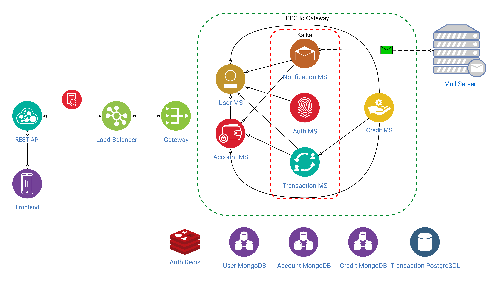
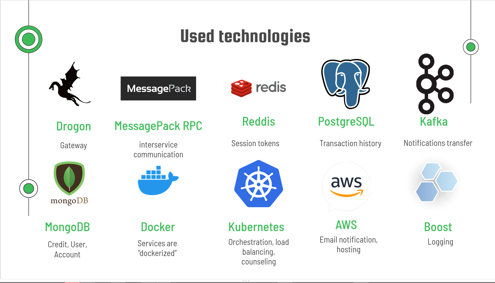

# UCU-bank

## Table of contents
- [Introduction](#introduction)
- [Features](#features)
- [Project structure](#project-structure)
- [Tools and frameworks](#tools-and-frameworks)
- [Setup](#setup)
- [Usage](#usage)
- [Contributors](#contributors)

## Introduction
UCU Bank - simple implementation of the online banking system.

This project is a semester project for three courses: Software architecture (SWA), Information security (IS) and Modern C++, so it has to fit the following "general" requirements:
- Flexible and reliable microservice architecture 
- Secure architecture with modern security features
- Fast, modern & flexible code that uses most modern features of c++

### Implementation requirements
- Simple web interface, where user can sign up/login1 using his passport data
- Users can create many cards
- Users can make money transactions to other users
- Users can make a deposit or take credit with a fixed percentage
- There should be privileged accounts of bank workers, where they see all accounts, amount of money on cards, personal information of users
- All transaction data and data about the amount of money should be duplicated on many databases and secured properly
- It should be guaranteed that in case of any software or hardware error, the system remains consistent and correct (i.e., there should not be a situation when an error happened while processing transaction, money on sending account are withdrawn, and they didn't appear on the other account, or vice versa)

## Features
### Security features
| status | feature |
|:------:| :---------------- |
|  DONE  | Salted password hashing (BCrypt Password Encoder) |
|  DONE  | 2 - factor authentication with password + email |
|  DONE  | Use SSL  |
|  DONE  | Request identification (authenticate each request and authenticate the request even after post-login1. This will prevent any session hijack) |
|  DONE  | Role-Based access control for admin/regular | 
|  DONE  | The alert mechanism ensures that the customer remains informed of all the critical events that can have a financial impact |
|  DONE  | Captcha |


## Project structure


## Tools and frameworks

Base language - python 3.8. For front-end - ReactJS 17.0.2

### Base frameworks:

#### Backend:

- NoSQL Database - MongoDB
    - Is Document-Oriented, which makes it easy to use - just like ordinary dictionary
    - Supports distributed systems
    - Has good documentation and convenient python binding
- Relational DataBase - PostgreSQL
  - Good documentation
  - Open source
- Drogon
  - Is highly asynchronous
  - Supports REST API
- Reddis
  - Simple and highly effective distrubuted map
- AWS SES
  - Used for double verification & hosting
- Kafka
    - Fast
    - Makes it really easy to create distributed system and maintain dataflow
    - Many examples of real usage
    - Easily can become a message broker between microservices
    - Used for notifications
- rpclib + msgpack
  - used for communication between services
  - Simple and effective
  - Can be async
- Docker
  - Used to isolate microservices
- Kubernetes
  - Used to orchestration, SSL, deployment
- Safety:
    - bcrypt library - for password hashing
    - pyotp - 2 - factor authentication

#### Frontend:
- MaterialUI
	- Has many built-in UI elements that speeds up developing
	- Quite well-looking
- react-google-recaptcha
	- Simple way to use captcha


## Setup
**a. No docker & kubernetes, manual:**
  0. Install dependencies.
      - Archlinux:
      ```bash
      sudo pacman -S postgresql mysql hiredis util-linux-libs openssl zlib
      ```
        Make sure you have running services: `kafka`, `mongodb`, `postgres`, `redis`
    
        In  a postgres create database `transactions` and run `./scripts/setup_transaction_table.sql` there
        
        Make sure, that you AWS credentials are in `~/.aws/credentials`
  1. Compile:
  ```bash
  mkdir build &&  cd build
  cmake --preset release-posix ..
  cmake --build release-posix -j8 
  ```
  2. Start all services. List of binaries you have to run:
     1. ./bin/user
     2. ./bin/account
     3. ./bin/auth
     4. ./bin/notification
     5. ./bin/credit
     6. ./bin/transaction
     7. ./bin/gateway
  3. Start UI:
```bash
cd ucu24
npm install
sudo npm install --global http-server
npm run build
sudo http-server ./build --ssl --cert ucu24.com.crt --key ucu24_com.pem --cors -p 443
# or if you don't have a certificate:
sudo http-server ./build --cors -p 80
```
b.**docker + kuberneters automated** 
0. Install minikube and kubectl
1. Go to kuber.yaml and put there your AWS credentials line 125-126
2. Install everything
```bash
# install and start everything:
kubectl apply -f ./kube.yaml
# wait until everything is pulled and started
kubectl get all
# forward gateway port
kubectl port-forward gateway 2020:2020
# start UI
cd ucu24
npm install
sudo npm install --global http-server
npm run build
sudo http-server ./build --cors -p 80
```


## Usage
UI is self-explanatory

    

## Contributors
UCU bank - project of four [APPS UCU](https://apps.ucu.edu.ua/en/) students:
- [Pavlo Hilei](https://github.com/Pavlik1400)
- [Yevhen Pankevych](https://github.com/yewhenp)
- [Volodymyr Tsapiv](https://github.com/Tsapiv)
- [Max Bilyk](https://github.com/mak9su4roi)
